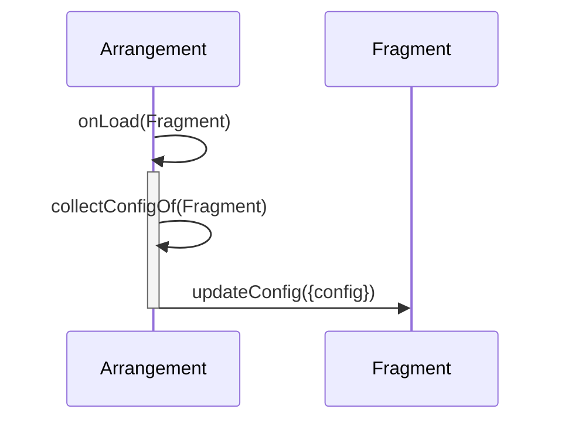

# Config
Manages the handling of configuration.
With configurations an arrangement gets the possibility to configure an embedded fragment and overwrite the default configuration of it.

The Collage will merge config objects for specific MFs in order:
1. an empty object
1. the config object that matches the url
1. the config object that matches the name
1. the config properties on the dom element
     

