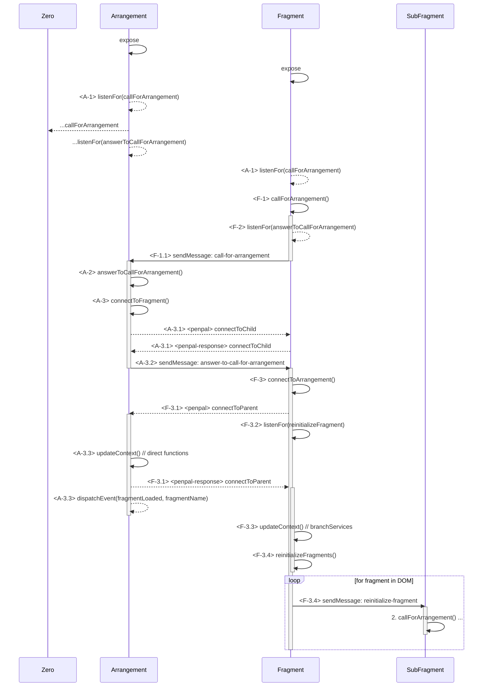

# Handshake
With the handshake plugin, we connect the fragment to it's arrangement, so both are able to comunicate with each other.

## Arrangement
An arrangement defines the layout and configuration of it's embedded fragments and is able to use the Direct Functions API to communicate with its fragments directly.
An arrangement can be a fragment itself and thus be embedded into other arrangements.

The arrangement initiates the handshake with each of its fragments to enable communication.

## Fragment

## Handshake

> penpal wants to always initiate a handshake from parent to child, while we intend to do it the other way round, so we are setting up the handshake in a separate plugin

The handshake between a fragment and a potential arrangement works like this:

1. before `expose` is called (during the import), a beacon for potential fragments is initialized.
2. when a fragment calls `expose`, it sends a _ping_ postMessage to the window at `window.parent`
3. when after 300ms no answer arrives, we asume to be alone and end the handshake
4. if we receive an answer message, we assume to be embedded in an arrangement.


### Sequence Diagrams of the handshake procedure

The following sequence diagram describes the handshake procedure in detail.
The steps of the handshake procedure are prefixed in pointy brackets with the following meaning.

* `<A-1>` Step 1 that is performed in the arrangement
* `<F-1>` Step 1 that is performed in the fragment
* `<penpal>` A step, that involves penpal direcly
These steps are referenced in comments in the [handshake plugin](./handshake.ts)

The diagram shows four entities:
1. `Zero` - a non-existing document or a document not calling a collage expose function
1. `Arrangement` - an arrangement
1. `Fragment` - a fragment embedded in `Arrangement`
1. `SubFragment` - a fragment embedded in `Fragment`

#### Sequence Diagram for a system of an Arrangement, a Fragment and a SubFragment


### penpal functions
Collage uses penpal to perform the communication between an arrangement and a fragment. It builds upon the penpal functions to add features like direct functions, services and topics.

All references to penpal are encapsulated in the handshake plugin (see [handshake.ts](./handshake.ts) and [handshake-data.ts](./handshake-data.ts)).

#### how it is done
After a the Arrangement and the Fragment have performed the first steps of the handshake (`<A-1>`, `<A-2>`, `<F-1>`, `<F-2>`, and `<F-1.1>`), the fragment has the information that it is embedded in an arrangement and the Arrangement has the information, that it embedds a fragment. Now we can start to initialize penpal to establish the communication between them. To do so, we utilize the functions `connectToChild()` and `connectToParent()` from penpal:

```typescript
const connection = connectToChild({
    iframe: fragmentIframe,
    methods: extractAsArrangement(data),
    childOrigin: '*',
    debug: PENPAL_DEBUG,
});
```

This sets all functions that are specified in the FrontendDescription of the Arrangement (see extractAsArrangement()) to be CallableFunctions on the penpal parent (the Arrangement). The penpal child (the Fragment) is able to call them. 

```typescript
connectToParent({
    methods: extractAsFragment({
        description: data.description,
        context: data.context as GenericPluginAPI,
        callback: (description: FrontendDescription) => updateConfigCallback(description)(data.context),
    }),
    debug: PENPAL_DEBUG,
})
```

This sets all functions that are specified in the FrontendDescription of the Arrangement (see extractAsArrangement()) to be CallableFunctions on the penpal child (the Fragment) by the penpal parent (the Arrangement). It additionally sets the three functions `description`, `context` and `callback`. These functions allow to access the fragments context and FrontendDescription and to update the fragments configuration
