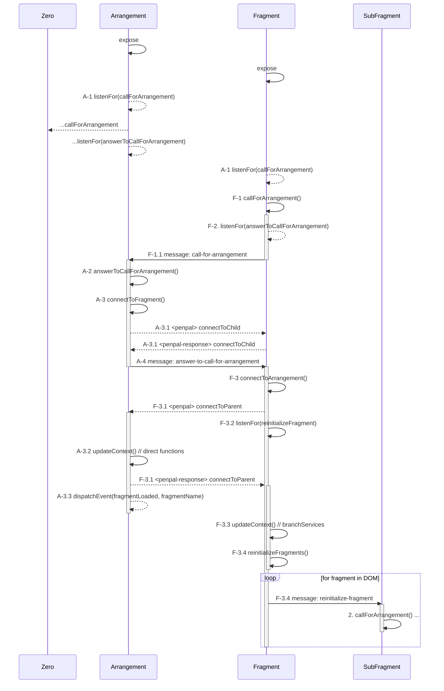

# Handshake

## Arrangement
An arrangement defines the layout and configuration of it's embedded fragments and is able to use the Direct Functions API to communicate with its fragments directly.
An arrangement can be a fragment itself and thus be embedded into other arrangements.

The arrangement initiates the handshake with each of its fragments to enable communication.

> penpal wants to always initiate a handshake from parent to child, while we intend to do it the other way round, so we are setting up the handshake in a separate plugin

The handshake between a fragment and a potential arrangement works like this:

1. before `expose` is called (during the import), a beacon for potential fragments is initialized.
2. when a fragment calls `expose`, it sends a _ping_ postMessage to the window at `window.parent`
3. when after 300ms no answer arrives, we asume to be alone and end the handshake
4. if we receive an answer message, we assume to be embedded in an arrangement. 

