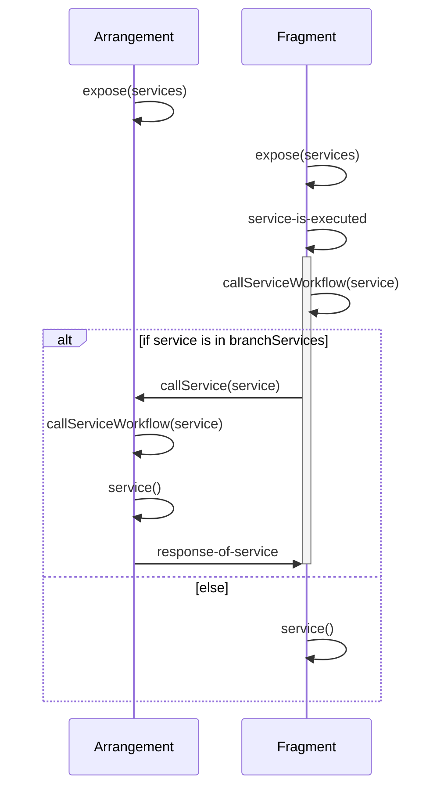

# Services


# Service Functions

Using penpal, we expose a number of functions that we can use ourselfs later on. These functions may be overwritten by a arrangement if one exists and if it contains a service function with the same name.

```javascript
const {
  services: {
    // You are guaranteed to receive service functions for all service functions
    // you did expose. Some of them may be overwritten though.
    foo, bar, baz
  }
} = await expose({
  // any number of named functions that act as an overwritable service
  services: {
    foo() { /* ... */ },
    bar() { /* ... */ },
    baz() { /* ... */ },
  }
})
```

Each service function should act as follows, when called:

1. attempt to obtain the penpal-parent connection
2. (if connected) attempt to call service function on penpal parent
3. (if successful) return the returned value to the client
4. (if not connected or no such service on parent) call own implementation and return the return value

The services feature allows an easy way to do a communication via a request response mechanism.

If several fragments will use the same service, the service implementation of the topmost arrangement will be used.

## Registering of Services

1. On expose(), every context registers its services in the "services" property.
    1. When the handshake is done, the top-most arrangement sends its services to all its fragments in the response to penpal-connect-to arrangement.
    1. When a fragment gets services sent from its arrangement, it registers them in the "branchServices" property of its context
    1. The fragment sends its services merged with its branchServices to all of its own fragments
1. On updateContext(), a context triggers the "reinitialize" function on all of its children and the services get synched again.

## Calling of Services


