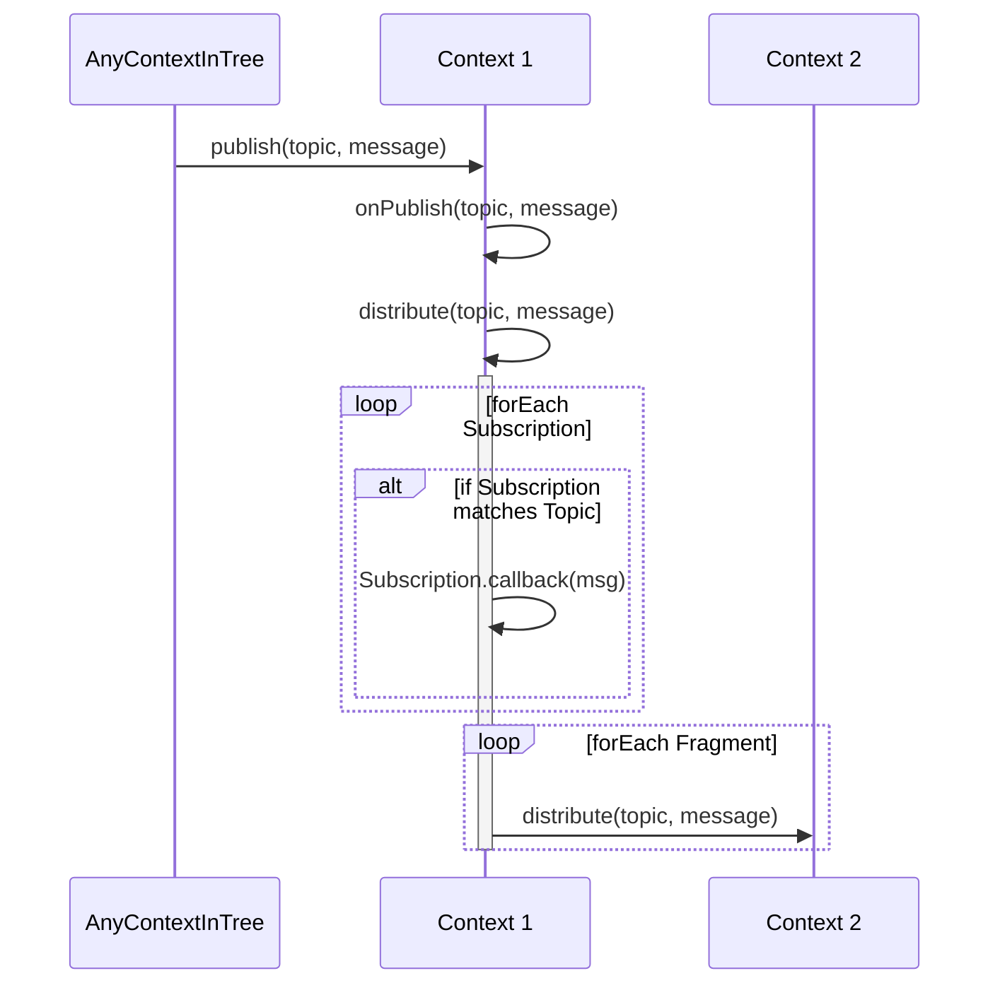

# Topics

The Topics feature allows an easy way to subscribe to topics and publish new values to topics.

Topics provides three stages:

* Stage 1: defining topics dynamically at runtime 
* Stage 2: defining topics in services at dev-time
* Stage 3: topics without service but defined at dev-time in a topics description

## Stage 1

Stage 1 topics allow to define topics at runtime from every context in the tree. Each context in the tree can dynamically subscribe and unsubscribe to the topic.

Topics Stage 1 uses the service-functions feature in the following way:

1. Every context has a built-in service __collage-topics-service, So the service from the topmost arrangement is used, when any context calls a method of __collage-topics-service.
1. If any context in the tree publishes a value to a topic, the publish method of the __collage-topics-service at the topmost arrangement is executed.a
1. The topmost arrangement stores the new current value in a Map of topics and values and triggers the distribute(topic, message) function.
1. On distribute(topic, message)
    1. callback of the topic subscription is executed
    1. execute distribute(topic, message) on every fragment of the context

## Stage 2

Stage 2 topics allow to define topics at dev-time (or better: before expose() is executed) as part of services.

## Stage 3

## TODOS
- Sugar method for unsubscribing all subscriptions of one topic (instead of needing to unsubscribe a topic with all the subscribed ids)
